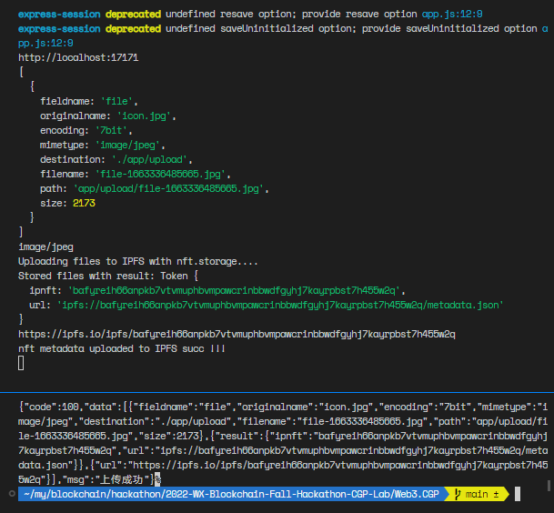

# 2022-WX-Blockchain-Fall-Hackathon-CGP-Lab

## 目录说明

```bash
.
├── cgp               # 前端,生成同态密文的公私钥与加解密
├── tool_etherscan    # 以太坊区块扫描器(使用 etherscan.io 的api)
└── Web3.CGP          # 后端服务,包括api,合约,NFT铸造中间件(用到了ipfs的nft.storage)
```

## cgp - 前端密文计算的用法

```js
// 引用库
import { HeManager } from 'he-manager-js';

const HeManager = new HeManager();

// 生成公私钥
// 256是生成公私钥的长度
heManager.heCreateKeys(256).then(keys => {
      console.log("pubkey:", keys.pubkey)
      console.log("seckey:", keys.seckey)
    });

// 加密函数
// plain: 需要加密的数字，字符串
// pubkey: 公钥
heManager.heEncryption(plain, pubkey).then(cipher => {
      console.log(cipher)
    });

// 解密函数
// cipher: 密文
// seckey: 私钥
// pubkey: 公钥
heManager.heDecryption(cipher, seckey, pubkey).then(plain => {
      console.log(plain)
    })
```

## Web3.CGP - CGP的后端服务

### 密文图谱合约
`Web3.CGP/contracts/cgp.sol`

```js
/** 向某一用户添加密文信誉值
* @param did 用户did
* @param cipher 增加用户信誉值密文
* @param pubKey 同态计算的公钥
* @param _type 信誉值增加的类别
*/
function addCredit(string memory did, string memory cipher, string memory pubKey, CredictTypes _type) public returns (string memory, int)

/** 验证权威机构开具的零知识证明
*/
function verifyProof(string memory proof, string memory pid) public returns (bool)
```

### NFT铸造中间件

这是一个 上传NFT元数据 并 铸造NFT 的中间件

#### 在NFT.Storage上上传nft的元数据文件
`Web3.CGP/app/scripts/upload.js`

```js
function MakeStorageClient() {
  // console.log(GetAccessToken() )
  return new NFTStorage.NFTStorage({ token: GetAccessToken() });
}

async function StoreContent(image, name, description) {
  console.log("Uploading files to IPFS with nft.storage....");
  const client = MakeStorageClient();
  const result = await client.store({
    image,
    name,
    description,
  });
  console.log("Stored files with result:", result);
  return result;
}
```



#### 在链上铸造NFT
`Web3.CGP/app/scripts/main.js`

```bash
curl -F 'file=@/mnt/d/Downloads/newnew/icon.jpg' http://127.0.0.1:17171/mint  

{"code":100,"msg":"铸造成功"}
```

## tool_etherscan 以太坊区块扫描器

```bash
#*Api-Key Token*
PKSVMJ95S7ZA63NGM5KM6K7FT1N3J737RH

#查询余额
#Get Ether Balance for a single Address
curl https://api.etherscan.io/api?module=account&action=balance&address=0xddbd2b932c763ba5b1b7ae3b362eac3e8d40121a&tag=latest&apikey=PKSVMJ95S7ZA63NGM5KM6K7FT1N3J737RH


### ERC20 Token
#指定接收方
http://api.etherscan.io/api?module=account&action=tokentx&address=0x5416f85b40342B751830C03486843A1E2f8F774c&startblock=0&endblock=999999999&sort=asc&apikey=PKSVMJ95S7ZA63NGM5KM6K7FT1N3J737RH

#指定Token合约地址
https://api.etherscan.io/api?module=account&action=tokentx&contractaddress=0x9f8f72aa9304c8b593d555f12ef6589cc3a579a2&address=0x4e83362442b8d1bec281594cea3050c8eb01311c&page=1&offset=100&sort=asc&apikey=PKSVMJ95S7ZA63NGM5KM6K7FT1N3J737RH

#指定接收方和Token合约地址
https://api.etherscan.io/api?module=account&action=tokentx&contractaddress=0x9f8f72aa9304c8b593d555f12ef6589cc3a579a2&address=0x4e83362442b8d1bec281594cea3050c8eb01311c&page=1&offset=100&sort=asc&apikey=PKSVMJ95S7ZA63NGM5KM6K7FT1N3J737RH


#查询接收方的所有订单(可限定查询的区块范围)
http://api.etherscan.io/api?module=account&action=txlist&address=0xddbd2b932c763ba5b1b7ae3b362eac3e8d40121a&startblock=0&endblock=99999999&sort=asc&apikey=PKSVMJ95S7ZA63NGM5KM6K7FT1N3J737RH

http://api.etherscan.io/api?module=account&action=txlist&address=0xde0b295669a9fd93d5f28d9ec85e40f4cb697bae&startblock=5000000&endblock=99999999&sort=asc&apikey=PKSVMJ95S7ZA63NGM5KM6K7FT1N3J737RH

```
